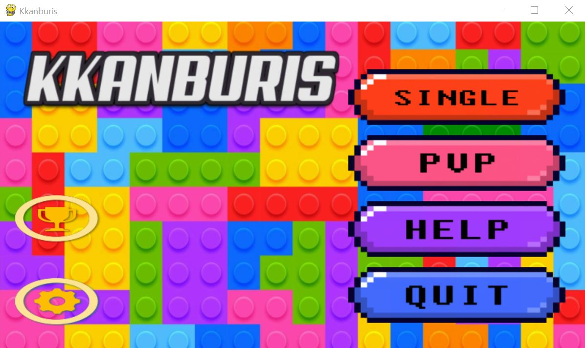
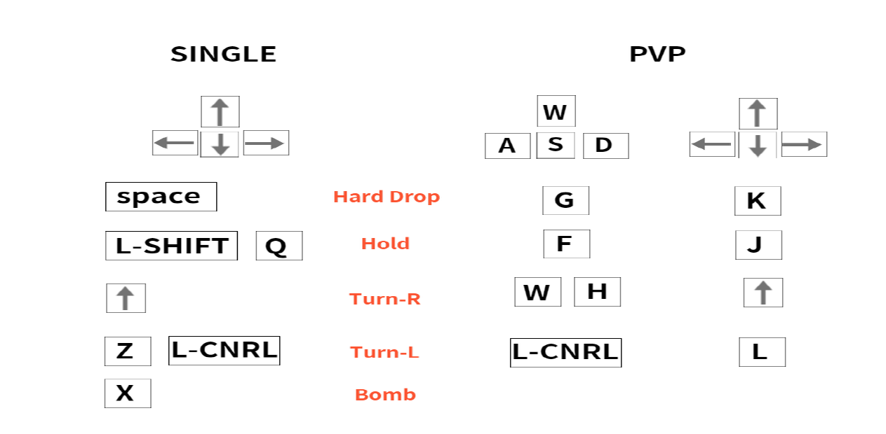
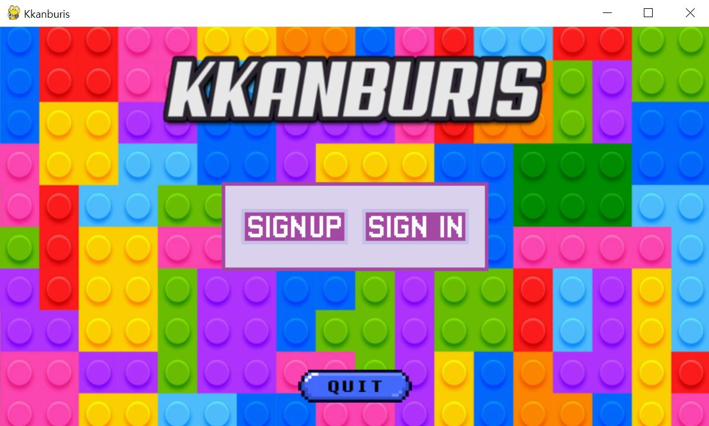
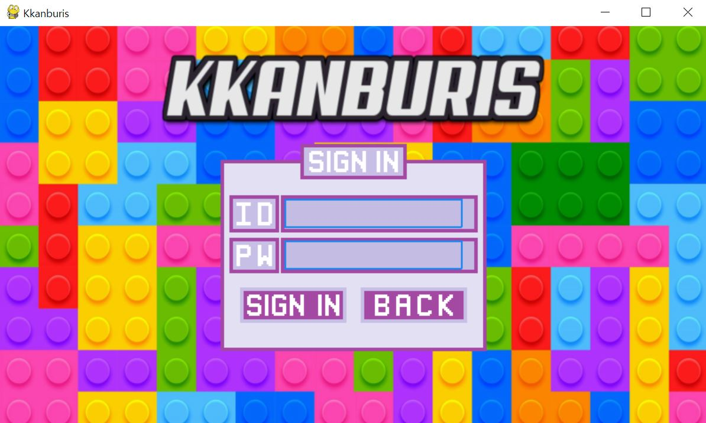
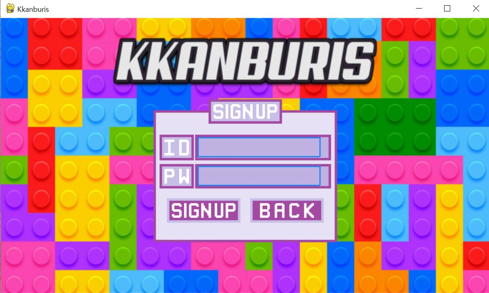
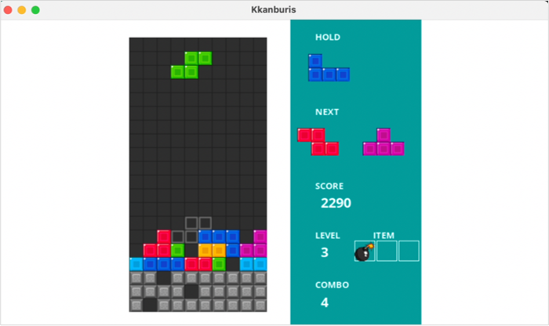

# 2021-2-OSSProj-KKANBU-5
-------------

  
**Team Leader**: [[심미경](https://github.com/Sim-mi-gyeong)]   
**Team Member**: [[김성호](https://github.com/sungho17)]
                 [[조수빈](https://github.com/jo-soobin)]

## How to play
### Installation (OS: Ubuntu)
1. `git clone https://github.com/CSID-DGU/2021-2-OSSProj-Kkanbu-5.git ` 

2. `pip3 install pygame` 

3. `pip3 install pymysql` 
   `pip3 install bcrypt` 

3. `cd Kkanburis` 

4. `python3 Kkanburis_ver2.py` 

### Main Page
 

### 조작키 안내
 

## Introduce
### Base Source
2020-1 Openmind [OMPYTRIS](https://github.com/CSID-DGU/2020-1-OSSP1-OpenMind-1)

#### <모드>
- Single mode: 한 명의 Player가 단독으로 게임 플레이. 콤보 아이템, 방해 블록 기능
- PvP mode: 두 명의 Player가 각각의 키보드 사용. 콤보 발생으로 상대방 ATTACK 기능. 게임 종료 후 승자의 점수 저장
  
## 새로운 기능

### 1. 회원가입 및 로그인  
  - OMPYTRIS: Leadearboard.txt 파일로 점수를 저장하고 리더보드에 나타나는 방식   
  - KKANBURIS: 로그인 정보를 AWS에 연동하여 전역적인 점수 저장 및 확인 가능

  - 게임 실행 시 첫 화면(sign in, sign up, quit)

   

  - sign in 클릭 시

  - singup 클릭시
  
  

### 2. Combo count reset 및 폭탄 아이템 추가
  - 최대 Combo count인 11을 달성하고 난 후, 다시 0으로 Combo Reset
  - 11 Combo 달성 시 폭탄 아이템 부여
  - 키보드 X 키를 눌러 폭탄 아이템 사용 가능(밑에서 5줄 삭제)
  - 폭탄 아이템 이미지: 
                          
  

### 3. Single 모드 장애물 설치
  - 기존 코드에서 PvP모드에서 상대방 ATTACK 시 바닥부터 장애물이 설치된 방식을 Single모드에도 적용
  - 난이도 조절을 위해 추가한 기능
  - 콤보 달성 시 attack point 누적 -> 장애물 등장
  - 폭탄 아이템 및 여러줄 콤보 달성으로 장애물 삭제 가능 
  - 장애물이 설치된 게임 화면:

  

## Block Speed(soft drop) -> KEY_DOWN pressed
| LEVEL           | speed(m/s)   |
|-----------------|--------------|
| LEVEL < 1       | 400          |
| LEVEL < 3       | 350          |
| LEVEL < 6       | 300          |
| LEVEL < 10      | 250          |
| LEVEL >= 10     | 200          |

## Block Speed(normal drop)
| LEVEL           | speed(m/s)   |
|-----------------|--------------|
| LEVEL < 1       | 450          |
| LEVEL < 3       | 400          |
| LEVEL < 6       | 350          |
| LEVEL < 10      | 300          |
| LEVEL >= 10     | 250          |

## Score
  - 블록 하강 시 점수 = score + level * 10
  - 콤보 발생 시 점수 = score + combo count * combo_count * 10 

## Credits
* 배경 이미지: (http://www.freepik.com)  
* 보드 이미지: (https://github.com/CSID-DGU/2020-1-OSSP1-OpenMind-1/tree/master/OMPYTRIS/assets/vector)
* 버튼 이미지: (https://www.miricanvas.com/)
* 로그인 페이지 이미지: (https://github.com/CSID-DGU/2021-1-OSSPC-BINSU-7)  

## References
* Base Source: (https://github.com/CSID-DGU/2020-1-OSSP1-OpenMind-1)  
* Login Page: (https://github.com/CSID-DGU/2021-1-OSSPC-BINSU-7)  